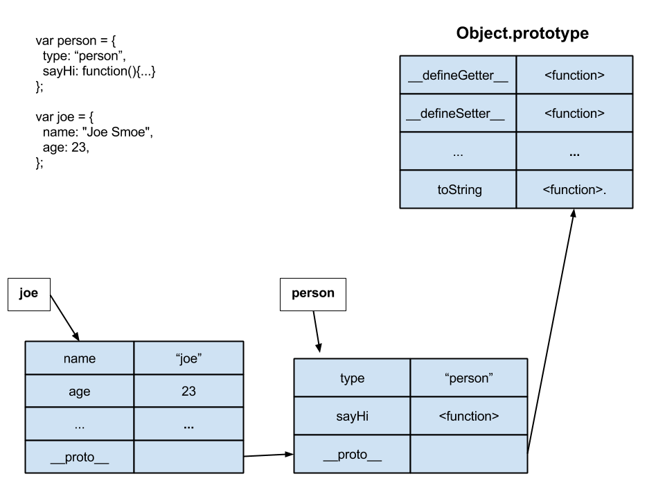

## Object Oriented Javascript

[Javascript Background](Background.md)

## Objectives

* Learn about the most common ways to create Javascript Objects and object properties.
	* Object Literal.
	* Factory Pattern.
	* Constructor Function.
	* ECMAScript 5 Object.create
* Use Javascript Namespaces.
* Learn about Prototypes and Prototypical Inheritence.
* How Object property lookup works.
* How Object method lookup works.

# Instructions

* Fork, clone your fork
* `cd` into your local copy
* run `npm install`
* run `bower install`
* run `grunt test`
* Follow along with the README and make the tests pass.

# Let's get started writing some javascript objects.


## There are no classes in Javascript.

Javascript does not have classes. *At least not yet, they are coming in ECMAScript 6*

But, it does provide a way to create structures that behave like classes. We'll see the few ways that we can create a *"class"* in javacript.


## Javascript has objects. There are 2 ways to create a new javascript object.

**create a new file in app/js/new_object.js**
You might want to write this code in it.

```javascript
// Using an Object constructor
var newObjectFromContructor = new Object();

// Using an Object Literal. Preferred
var newObjectFromLiteral = {};
```

**run `grunt test` to see if the tests pass**

### Objects have properties. There are 4 ways to add properties to an object.
Properties have values. You can think of these as key:value pairs. Some languages call this a dictionary, or a hash. The basic idea is that a key is unique and it has a value.

**create a new file in app/js/object_properties.js**
You might want to write this code in it.

```javascript
// we'll add properties to this object
var newObjectWithProperties = {};

// ECMAScript 3 compatible approaches
// 1. Dot syntax
// Set properties
newObjectWithProperties.someKey = "Hello World"; // Set properties
var someNewVariable = newObjectWithProperties.someKey; // Get properties

// 2. Square bracket syntax // Set properties
newObjectWithProperties["anotherKey"] = "Hello World"; // Set properties
var anotherNewVariable = newObjectWithProperties["anotherKey"]; // Get properties

// ECMAScript 5 only compatible approaches
// 3. Object.defineProperty
// Set properties
Object.defineProperty(newObjectWithProperties, "oneMoreKey", {
  value: "for more control of the property's behavior", writable: true,
  enumerable: true,
  configurable: true
});

// 4. Object.defineProperties // Set properties
Object.defineProperties( newObjectWithProperties, {
  "aNewKey": {
    value: "I like turtles", writable: true
  },
  "anOldKey": { value: "Foo bar", writable: false }
});
```
**run `grunt test` to see if the tests pass**


## Object Literals.

An Object literal is the simplest way to create an object in javacript. It looks and behaves somewhat like a Ruby hash but has some key differences.

**Create a file js/simple_object_literals.js**
You might want to write this code in it.

```javascript
// Create an Object literal representing one person.
var joe = {
  name: "Joe Schmoe",
  age: 23,
  // Property value is a function
  describe: function(){
    return this.name + " is " + this.age + " years old";
  }
};

// OR
var jill = {};
jill.name = "Jill Smill";
jill.age = 32;

// Property value is a function
jill.describe = function(){
  return this.name + " is " + this.age + " years old";
};

```

**run `grunt test` to see if the tests pass**

### Summary
An Object Literal:

* Has properties.
* Each property has a name and a value, name/value pairs.
* A property is typically a string, but can be it can be a number *(rare)*.
* A value can be a **Primitive** or an **Object**, aka reference type.
* A value can be a **function**. We call these properties methods.
* A value can be based on the built-in Object, see above, or a user defined object.
* By default is based on the built-in Javascript [Object](https://developer.mozilla.org/en-US/docs/Web/JavaScript/Reference/Global_Objects/Object).


## Objects with properties that are objects (or nested objects)

Object literals can have properties that are objects.

**Create a file js/simple_object_literals_address.js**
You might want to write this code in it.

```javascript
var judy = {
  name: "Judy Dench",
  age: 32
};
var fred = {
  name: "Fred Armison",
  age: 27
};

/*
Objects can have objects.
The siblings property's value is an Array
The address property's value is a Object literal.
The describe property's value is a Function, which is also an object.
*/

var jason = {
  name: "Jason Wharff",
  age: 34,
  occupation: "Software Developer",
  siblings: [judy,fred],
  address: {
    street: '44 Warren St.',
    city: 'Stoneham',
    state: 'MA',
    zip: 21144,
    display: function(){
       return this.street + ", " + this.city + ", " + this.state;
    }
  },
  describe: function(){
    return this.name + " is " + this.age + " years old";
  }
};
```
**run `grunt test` to see if the tests pass**

#### Objects properties and methods can change anytime.

Here we are setting the `jason` object literal's describe property with another (different) function.

There is no test for this, we just want you to be aware that you can update a property's value at any time.

```javascript
// Can change the describe function later, at runtime.
// by setting the describe property
jason.describe = function(showDetail){
  var info;
  if(showDetail){
    info = this.name + " age is " + this.age + ", address is: " + this.address.display();
  }else{
    info = this.name + " is " + this.age + " years old";
  }
  return info
};

// describe jason.
console.log(jason.describe(true));

// describe jason in detail
console.log(jason.describe(false));
```

## Prototypical Inheritence

Each object will have an internal `__proto__` property that can point to another object. An Object Literal's `__proto__` property will point to the [Object.prototype](http://goo.gl/C568wU) by default.

An object's `__proto__` pointer will be used to lookup properties, *(values and methods)*.


For the example above:
* When one calls joe.toString().
* js will look for the property toString in the joe object literal.
* It will **not** be found.
* js will look for the property toString in the object pointed to by `joe.__proto__`. *This is the Object.prototype.*
* js will find the toString method on Object.prototype and execute it.

**By setting this `__proto__` property we can *simulate* object inheritance.**

**Create a file js/simple_prototype.js**
You might want to write this code in it.

```javascript
// The person object inherits from the base javascript Object.prototype
var person = {
  type: 'person',
  name: 'person',
  sayHi: function(msg){
    return this.name + " says " + msg;
  }
};

/* Create an Object literal called `jeff` representing one person.
————————————————————————————————————————————————————————————————————————
the `jeff` object should have three properties: name: String, age: Number, describe: function(){}
the `jeff` object inherits from the person object: jeff.__proto__ = person
*/
var jeff = {
  name: "Jeff Horn",
  age: 23,
  describe: function(){
    return this.name + " is " + this.age + " years old";
  }
};

jeff.__proto__ = person;

/*  The sayHi property for jeff will be found by following jeff's __proto__ property. */
jeff.sayHi('hello world');
```
**run `grunt test` to see if the tests pass**

<!--  -->

For the example above:
* When one calls jeff.sayHi("hey there").
* js will look for the property sayHi in the jeff object literal.
* It will not be found.
* js will look for the property sayHi in the object pointed to by `jeff.__proto__`. This is the person object.
* js will find the sayHi method on the person object and execute it.

### Use Object Literals for objects that are only created once.

What if we want to create a lot of people?

We will have to create lots of object literals and each time a property or method changes we'll have to change each object literal in the program. *Makes maintainence very difficult and the code not DRY*. For example, what if we want to change each person to have an occupation that is shown in the describe function?

Use Object literals for instances that will exist only once, or *Singletons*, in your application. For example, CarLot or RecordCompany.

Later, we will see how to emulate a class in Javascript that will be used to create instances, or objects, of something.

## Using Object Literals to create a Namespace.

**Create a file js/simple_namespacing.js**
You might want to write this code in it.


```javascript
/*
Namespacing in Javascript
————————————————————————————————————————————————————————————————————————
Javascript namespaces are used to disambiguate names in an application and prevent polluting the global namespace. This is so that names in an application do not conflict. Typically, name conflicts may happen when using a third-party library or plug-in, such as Bootstrap, jQuery, AngularJS, EmberJS, BackboneJS, or any other Javascript/CSS framework.

create a namespace for this PersonApp
If PersonApp object already exist than set it to itself.
Otherwise set it to an empty object literal.
*/
var PersonApp = PersonApp || {};

// Namespace an object literal
PersonApp.joe = { name: 'joe', age: 23 };

// Namespace a Factory
PersonApp.createPerson = function(){ ... };
var joe = PersonApp.createPerson('joe', 23);

// Namespace a Constructor Function
PersonApp.Person = function Person(){ .. };
var jill = new PersonApp('jill', 33);

/*
Note:
The var PersonApp = PersonApp || {}; will be set in each file that uses the namespace. Only the first file will actually set the PersonApp to {}. The other files will just assign PersonApp to itself.
*/
```

## Object Creation Patterns.

The problem with Object Literals is that they can get very tedious. For example, if we have to create a new object literal for each Person and there are many people.

Or I may want to add a property or change a method for a person then I MUST do this for every single person in the app!

**Use Object Literals for objects that are only created once.**

Let's look at some ways we can create Objects.

* Factory Pattern
* Constructor Function
* ECMAScript 5 Object.create


### The Factory Pattern (optional).

The Factory Pattern will use a function to create object literals. The arguments to the factory function will be used to initialize and set the object being created.

[Factory Pattern](FactoryPattern.md)


## LAB

Redo the Car Lot Lab above using the Factory pattern. **Do all your work in the cars_factory_pattern branch**

## Demo

### The Constructor Function Pattern.

This is the most common way to create objects in Javascript. It's the most common way to implement Classes. This pattern is used with the javascript *new* keyword to create objects.

Many environments, including browsers, are optimized to use this kind of constructor. The *convention* is to uppercase the first name of a function that will be used as a constructor.


**Create a file js/constructor_function.js with the below code and reference it from index.html.**


```javascript
debugger;

// Constructor Function object creation
// Constructor function is camel cased by convention.
var Person = function(name, age){
  // When new Person(...) is invoked
  // this = {};
  // this.__proto_ = Person.prototype
  debugger;

  this.name = name;
  this.age = age;

  // return the this pointer
  // return this;
};

Person.prototype = {
   describe: function(){
    return this.name + " is " + this.age + " years old";
   }
};

var joe = new Person('joe', 23),
  jill = new Person('jill', 32);

console.log(joe.describe());
console.log(jill.describe());
```

**BIG NOTE:** The *`__proto__`* property is NOT the same as the *`prototype`* property.
The `__proto__` property is **ONLY** used for object property lookup.
The `Function.prototype` property will only exist for functions.

##### Property Lookup and the Prototype.

Whats happening when we call joe.describe().

For the example above:
* When one calls joe.describe();
* js will look for the property describe in the joe object literal.
* It will not be found.
* js will look for the property describe in the object pointed to by `joe.__proto__`. This is the Person.prototype object.
* js will find the describe method on the Person.prototype object and execute it.


**Run the above code and look at the Person.prototype and object `__proto__`properties.**


## LAB
Redo the Car Lot Lab above using Constructor Functions. **Do all your work in the cars_constructor_function branch.**

## Demo
### Object.create (optional)

ECMAScript 5 defined a new way to create an object. Object.create(...).

You will be seeing this more as time goes on and developers make use of this. For now, we will be using the Constructor Function to create objects.

[Object.create](ObjectCreate.md)

### References
* [MDN Object Oriented Javascript](https://developer.mozilla.org/en-US/docs/Web/JavaScript/Introduction_to_Object-Oriented_JavaScript)

* **Zakas, Nicholas C. (2011-12-20). Professional JavaScript for Web Developers**
Chapter 6.
	* The Factory Pattern.
	* The Constructor Pattern
	* Constructors as Functions
	* The Prototype Pattern
	* How Prototypes Work
	* Alternative Prototype Syntax
	* Dynamic Nature of Prototypes
	* Problems with Prototypes
	* Combination Constructor/ Prototype Pattern

* [Object Playground](http://www.objectplayground.com/)
* [The Four Layers of Javascript OOP](https://www.youtube.com/watch?v=VJOTcUsD2kA&app=desktop)

## Summary.

* Javascript is standardized by ECMAScript. Currently we are using ECMA 5, but ECMA 6 is right around the corner with new functionality.
* Primitves Types are built-in and atomic.
* Some Primitves Types have object wrappers.
* Primitive Types are assigned to variables and properites by value.
* Reference Types, Objects, are assigned to variables and properties by reference.
* Object Literals are somewhat like Maps or Hashes in other languages.
* Object Literals should only be used when you ONLY need one instance of an object.
* Creating Objects with the Factory Pattern, or Factory method.
* Creating Objects with the new keyword and Constructor functions. **USE THIS METHOD**
* Creating Objects with Object.create(...).
* Most prevalant way to create objects is with the 'new' keyword and Constructor Functions.
* Learn about Prototypes and Prototypical Inheritance.
* Learn about property and method lookup.


